# Модуль определения режимов работы и аномального поведения вентилятора. Руководство разработчика.

Предиктивное обслуживание оборудования, такого как вентиляторы, насосы и электродвигатели, играет ключевую роль в современной промышленности. Это подход, основанный на мониторинге состояния и производительности оборудования в реальном времени для определения вероятности его отказа. Это позволяет операторам предпринять действия по устранению неполадок до того, как они приведут к серьезным последствиям, таким как простои в производстве или дорогостоящий ремонт. Это помогает увеличить эффективность оборудования, продлить его срок службы и снизить затраты на ремонт и замену. Кроме того, предиктивное обслуживание способствует безопасности рабочего места, предотвращая неожиданные отказы оборудования, которые могут привести к несчастным случаям на производстве. 

Давайте воспользуемся модулем определения режимов работы и аномального поведения вентилятора «Anomaly Detection for fan» с искусственным интеллектом для создания простого устройства, которое будет способно обучаться режимам работы вентилятора и сообщать о них или возникшей аномалии с помощью голосового интерфейса. 

Варианты использования устройства:

* Определение режимов работы оборудования и его неисправности
* Полевой датчик информации для систем предиктивного обслуживания 

Примеры оборудования:
* Электродвигатели
* Помпы, насосы, турбины
* ДВС
* Генераторы
* Холодильные установки

Видео работы устройства [ссылка появится позже]

## Подготовка
Нам потребуются следующие элементы:

**Модуль ключа на базе Seeed Studio XIAO ESP32C3**

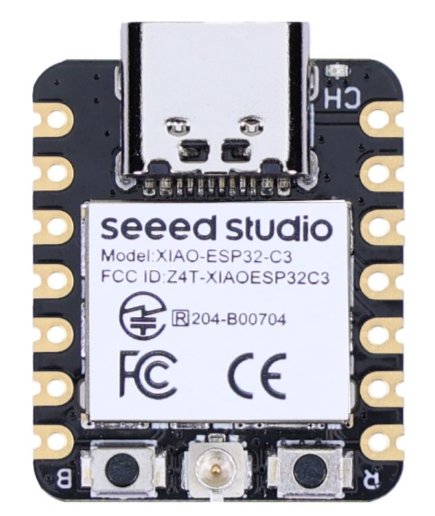

 
Технические характеристики

 
* Процессор: ESP32-C3 SoC. 32-битный одноядерный процессор RISC-V с четырехступенчатым конвейером, который работает на частоте до 160 МГц.
* Беспроводной модуль: полная подсистема Wi-Fi 2,4 Гц. Bluetooth 5.0/ Bluetooth mesh.
* Встроенная память: SRAM-память - 400 Кб, флэш-память - 4Мб.
* Интерфейсы: 1x UART, 1x IIC, 1x SPI,11x GPIO (ШИМ), 4x АЦП. 1x кнопка Reset , 1x кнопка Boot.
* Размеры: 21 x 17,5 мм.
* Питание: рабочее напражение сети: 3.3В@200мA.
* Питание зарядки: 50мA/100мA.
* Напряжение на входе (VIN): 5В.
* Потребление питания в спящем режиме: Спящий режим >44 μА.
* Потребление питания при включённом Wi-Fi: Активный режим: <75 мA.
* Спящий режим модема: <25 мA.
* Режим неглубокого сна: <4 мA.
* Потребление питания при включённом BLE: Спящий режим модема: <27 мA.
* Режим неглубокого сна: <10 мA.
* Рабочая температура: -40°C ~ 85°C.

**Микрофон INMP441**

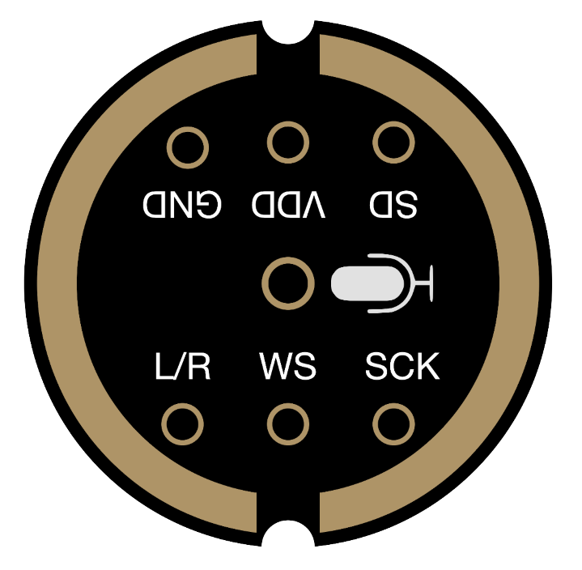

 
Технические характеристики

 
* Цифровой интерфейс I²S с высокоточным 24-битными данными.
* Высокое ОСШ: от 61 дБА.
* Высокая чувствительность: от -26 dBFS.
* Плоская частотная характеристика от 60 Гц до15 кГц.
* Низкое энергопотребление: 1.4 мА.
* Высокий PSR: −75 dBFS.
* Малые габариты: 4.72 мм × 3.76 мм × 1 мм.
* Пригоден для пайки с оловянно-свинцовым припоем и припоем без свинца.
* Соответствие стандартам RoHS/WEEE.

**Динамик DXI30N-A**

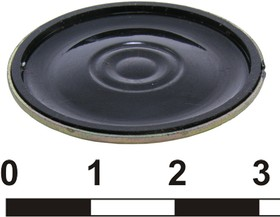

 
Технические характеристики

* Эффективный рабочий диапазон частот 200-8000 Гц.
* Предельная мощность: шумовая - 0,5 Вт, пиковая - 1,5 Вт.
* Номинальное электрическое сопротивление (импеданс), Ω 8 Ом.
* Уровень характеристической чувствительности 85±3 дБ.
* Неравномерность АЧХ 18 дБ.
* Габаритные размеры Ø30х4,8 мм.

**Усилитель класса D i2s MAX98357A**

 
Технические характеристики

* Выходная мощность: 3,2 Вт при4 Ω, 10% КНИ, 1,8 Вт при 8Ω, 10% КНИ, с обеспечением в 5 В.
* PSRR: 77 дБ тип @ 1 КГц.
* Частота дискретизации I2Sот 8кГц до 96кГц.
* MCLK не требуется.
* Уменьшение лишних шумов.
* Пять коэффициентов усиления на выбор: 3дБ, 6 дБ, 9 дБ, 12 дБ, 15 дБ.
* Отличная система подавления щелчков и хлопков.
* Защита от перегрева

**Плата расширения Grove Shield для XIAO с чипом управления батареей**

 
Технические характеристики

* Встроенная функция для зарядки и контроля работы литиевого аккумулятора.
* Grove разъёмы (Grove IIC x 2, Grove UART x 1), всего выведено 14 GPIO.
* Компактный и легко разбирающийся дизайн.
* Выделена контактная площадка для Flash SPI.
* Встроенный переключатель питания и световой индикатор зарядки.
* Рабочее напряжение: 3,3В / 3,7В литиевого аккумулятора.
* Электрическая ёмкость: 800мA.
* Питание зарядки 400мA (макс).

**Трёхосевой цифровой акселерометр Grove (LIS3DHTR)**

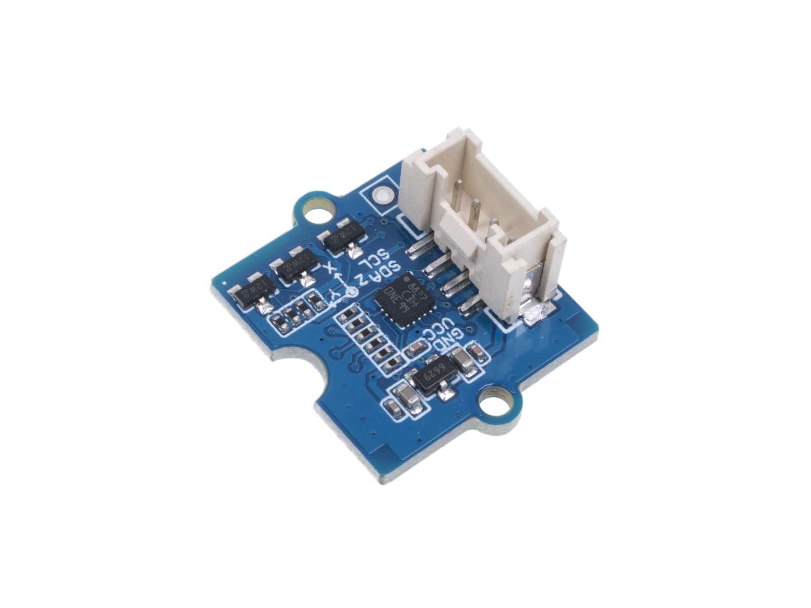

 
Технические характеристики

* Питание: 3/5 В.
* Полный диапазон динамически выбираемых параметров ±2g/±4g/±8g/±16g.
* Цифровой выходной интерфейс I2C/SPI/АЦП.
* 16-битный вывод данных.
* 2 независимых программируемых генератора прерываний для определения движения и свободного падения.
* Определение ориентации в 6D/4D.
* Распознавание свободного падения.
* Распознавание движения.
* Встроенный температурный датчик.
* Востренный механизм самопроверки.
* Встроенные 32 уровня 16-битного вывода данных FIFO.

**Кнопка Grove**

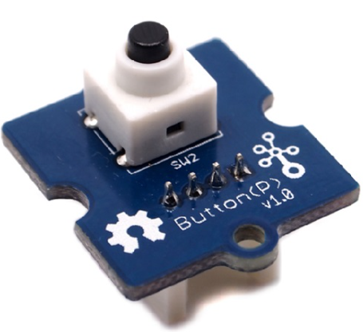

 
Технические характеристики

* Рабочее напряжение: 3,3/5В.
* Ресурс: 200 000 циклов.
* Усилие нажатия: 100 ± 50gf.
* Рабочая температура: -25℃ до +70℃.
* Габариты: 20ммX20мм.

**Универсальные 20см кабели Grove - с 4-мя контактами**

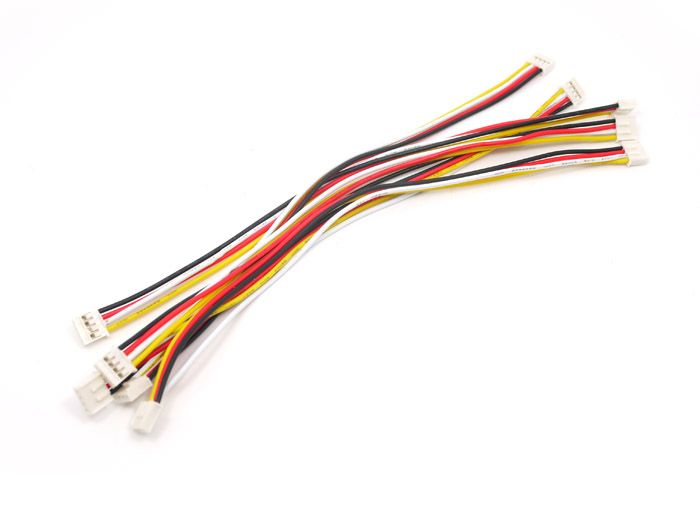

**Переходные кабели Grove с четырьмя контактами и женским разъёмом типа джампер**

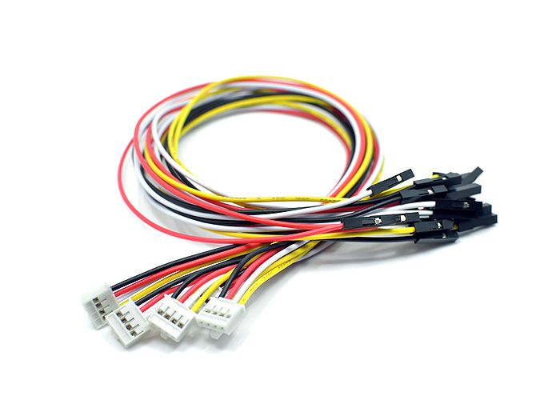

## Схема подключения

В качестве оборудования, диагностику которого будем производить, предлагаем использовать любой вентилятор, который может работать не нескольких скоростях (имеет несколько режимов работы). 
Ниже фотография стенда, который мы собрали для примера, с использованием обычного вентилятора, на который установили акселерометр, подключили его к модулю детекции аномалий с помощью макетной платы Seeduino, и добавили рекомендуемое оборудование. 

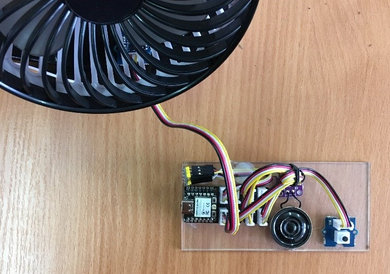

Для простой сборки макета устройства мы можете использовать плату расширения Grove Shield:

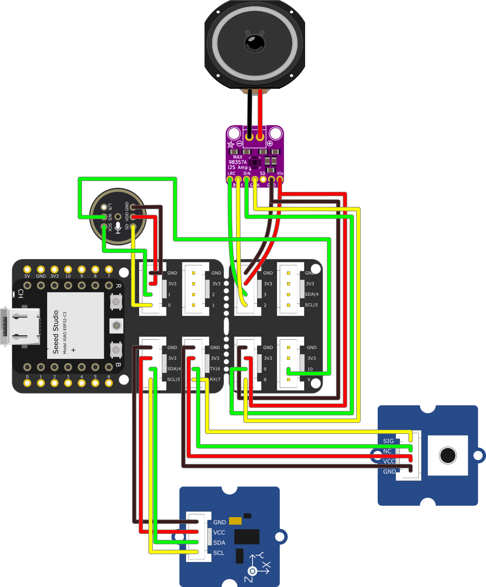

Или можно обойтись без платы, подключая оборудование непосредственно к ножкам модуля:

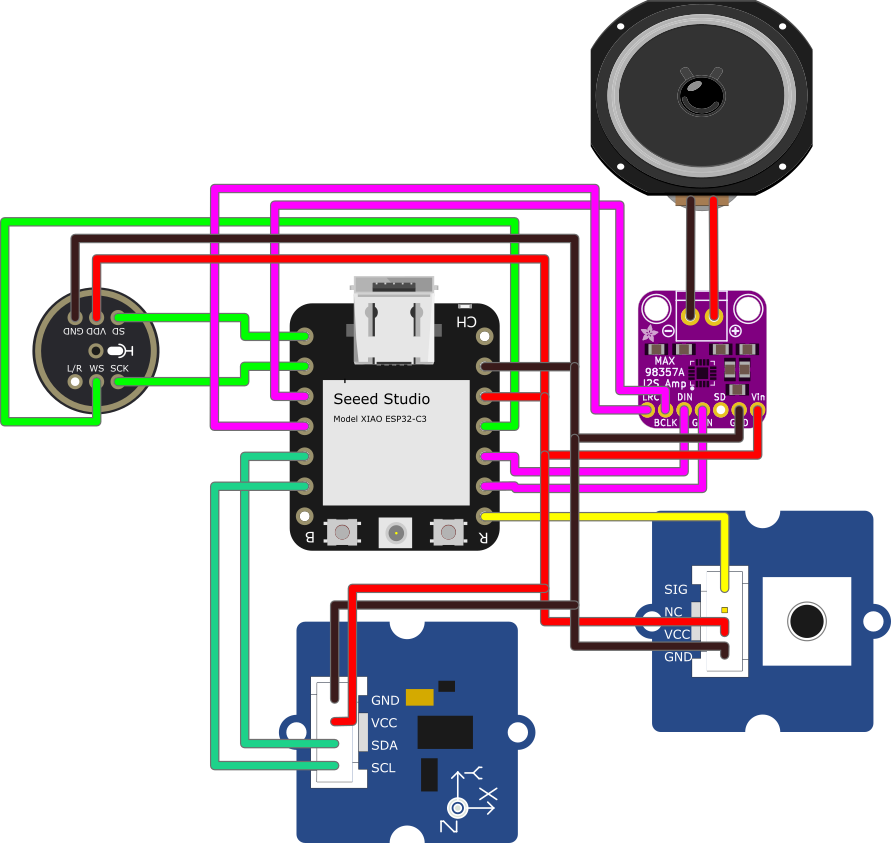

Схема какая ножка модуля за что отвечает:

Также Вы можете использовать свои элементы, учитывайте, что модуль сконфигурирован для работы с элементами с определенными параметрами, которые указаны в Технических характеристиках.

## Принцип работы

Устройство разработано с использованием чипа Seeed Studio XIAO ESP32C3. 
Это миниатюрная плата с 32-bit RISC-V процессором, работающим на скорости 160 МГц, имеющая 400 KB SRAM и 4 MB Flash-памяти.
Чип уже прошит, на нём находится программное обеспечение необходимое для работы, в том числе рекуррентная нейронная сеть, отвечающая за распознавание режимов работы и поиск аномалии. 
В отличие от общераспространенных сверточных нейросетей, для рекуррентной сети вам не нужен огромный датасет, чтобы научить устройство распознавать режим работы вашего оборудование – оно обучается прямо на вентиляторе, двигателе или турбине, на которую установлен акселерометр в процессе работы. 
Общая блок-схема работы устройства и пояснения приведены на схеме ниже.

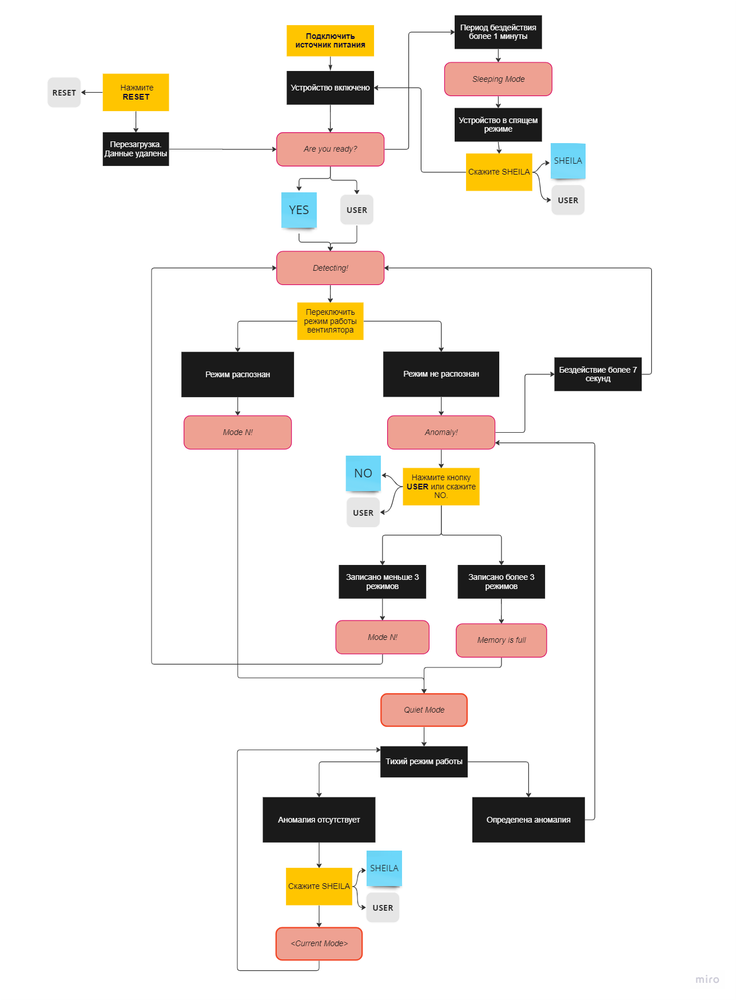

###  Режим обучения

Обучение выполняется в процессе распознавания аномалий. Когда устройство распознаёт режим, который является стандартным в работе вентилятора или иного устройства, как аномалию, пользователь может записать данное состояние как один из базовых режимов. Для этого следует запустить процесс распознавания в базовом режиме работы вентилятора, дождаться голосового сообщения “Anomaly!” (Аномалия!”) и сказать “NO” (“Нет”) или нажать кнопку USER.
Примечание: Устройство ждёт голосовой команды или нажатия кнопки в течение семи секунд, если пользователь ничего не делает, то устройство по истечении данного периода уходит в спящий режим.
Если в памяти будут свободные слоты для записи (в текущей реализации: 3, см. Общую схему работы AD), то режим запишется как “Mode N”, где N - порядковый номер записи. После обучения устройство переходит в режим распознавания.

### Режим распознавания

При первом включении и после перезагрузки устройство готово перейти к распознаванию аномалий. При появлении запроса «Are you ready?» («Вы готовы?», проверьте подключение акселерометра к вентилятору или иному устройству и скажите «YES» («Да») или нажмите кнопку «USER». После этого устройство начнёт сравнивать сохранённые в памяти записи состояний с текущей работой вентилятора. Если текущий режим работы не совпадает с сохранёнными образцами состояний, то устройство выдаёт голосовое сообщение: “Anomaly!” (Аномалия!”). При необходимости пользователь может записать режим в память устройства как один из базовых (см. Режим обучения).
Если устройство распознаёт текущий режим как один из базовых, то выдаётся голосовое сообщение “Mode N” (“Режим N”), где N - номер записанного режима.
 

### Режим ожидания

Устройство переходит в спящий режим после:

* периода бездействия более 1 минуты до начала запуска режима распознавания;
* после успешного распознавания записанного состояния;
* после бездействия пользователя более 7 секунд при обнаружении аномалии.

Для вывода устройство из спящего режима и перехода к распознаванию скажите «Sheila». 

